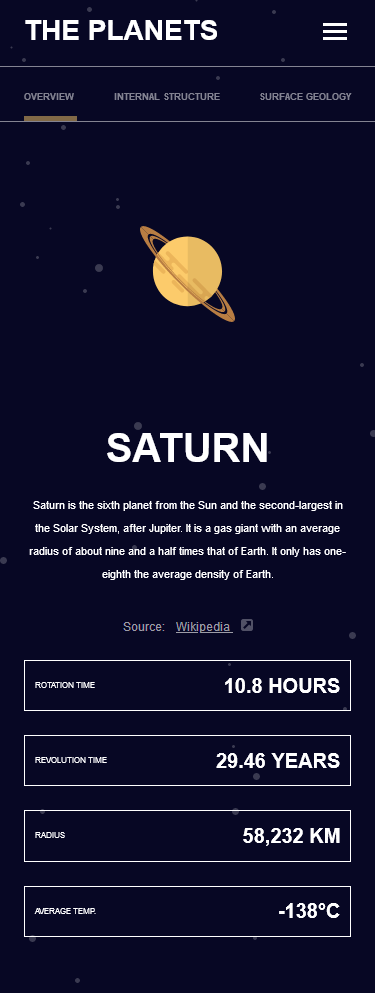
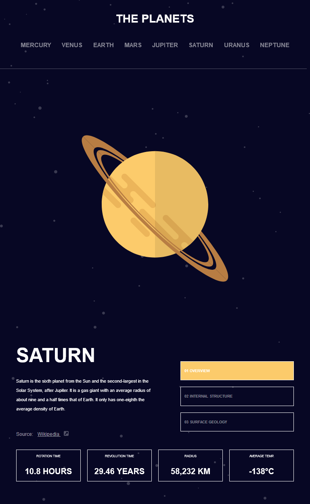
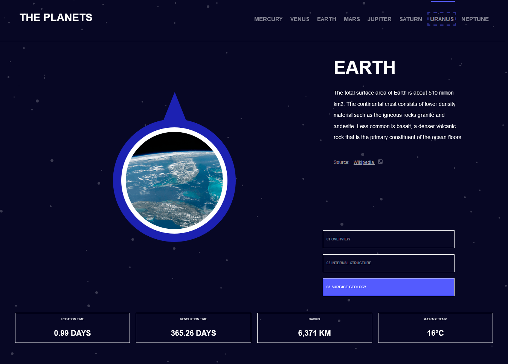

# Frontend Mentor - Planets fact site solution

This is a solution to the [Planets fact site challenge on Frontend Mentor](https://www.frontendmentor.io/challenges/planets-fact-site-gazqN8w_f). Frontend Mentor challenges help you improve your coding skills by building realistic projects.

## Table of contents

- [Overview](#overview)
  - [The challenge](#the-challenge)
  - [Screenshot](#screenshot)
  - [Links](#links)
- [My process](#my-process)
  - [Built with](#built-with)
  - [What I learned](#what-i-learned)
  - [Continued development](#continued-development)
  - [Useful resources](#useful-resources)
- [Author](#author)
- [Acknowledgments](#acknowledgments)

## Overview

### The challenge

Users should be able to:

- View the optimal layout for the app depending on their device's screen size
- See hover states for all interactive elements on the page
- View each planet page and toggle between "Overview", "Internal Structure", and "Surface Geology"

### Screenshot

### Links

- Live Site URL: [Add live site URL here](https://chamumutezva.github.io/planets-fact-site/)

## My process

### Built with

- Semantic HTML5 markup
- sass custom properties
- Flexbox
- CSS Grid
- Mobile-first workflow
- [parceljs](https://parceljs.org/) - sass compiler and bundler
- [gsap](https://greensock.com/get-started/) - animation library

### What I learned

- themes , applying different colours to the separate pages using sass.
[themes](https://www.sitepoint.com/dealing-color-schemes-sass/)

- animation, using the gsap library.
  - First , i tried using the import statement in the js file but did not work as that needs a compiler to use the es6 features in the browser.
  - i then used the cdn link by placing it in the body of the html file, just above the closing body tag. It is also important to place the cdn link above the js file to avoid `gsap undefined errors`
  - [Tabbed intefaces](https://inclusive-components.design/tabbed-interfaces/) . This was a major topic that i picked up in this challenge. The challenge includes 3 buttons like such that when clicked - they give related information in a separate panel. My first option was to use radio buttons but the above article gave a new dimension on how to handle the challenge.

### Continued development

- improving the accessibility of the site.
- improving tab control.

### Useful resources

- [Tabbed intefaces](https://inclusive-components.design/tabbed-interfaces/)
- [themes](https://www.sitepoint.com/dealing-color-schemes-sass/)
- [gsap](https://greensock.com/get-started/)
- [navigation menu button example](https://www.w3.org/TR/wai-aria-practices/examples/menu-button/menu-button-links.html)

## Author

- [Chamu Mutezva](https://github.com/ChamuMutezva)
- Frontend Mentor - [@ChamuMutezva](https://www.frontendmentor.io/profile/ChamuMutezva)
- Twitter - [@ChamuMutezva](https://twitter.com/ChamuMutezva)

## Acknowledgments

Many thanks to Matt and the Frontend Mentor community at large.
Frontend Mentor users @Grace (Grace Snow)
